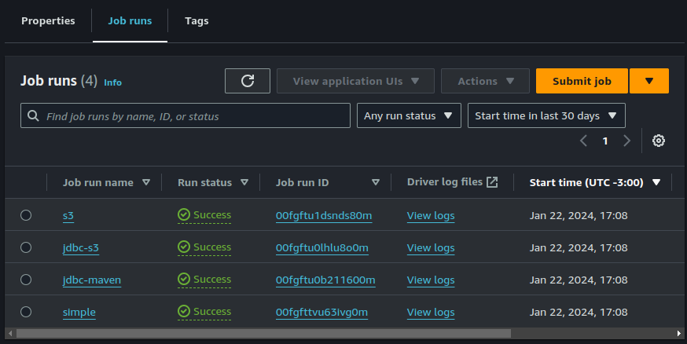
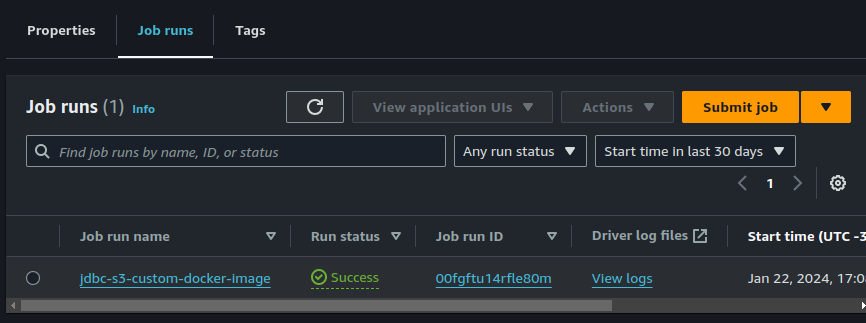

# EMR Serverless

This repository intends to provision all underline infrastructure in order to execute [Spark Jobs](https://spark.apache.org/) using [Amazon EMR Serverless](https://aws.amazon.com/emr/serverless/). Also it exemplifies how to execute simple Spark Jobs, how to handle Spark Dependencies and how to performed ordinary task like read from database and read/write from S3.


In order to performes theses ordinary task the follow scripts were developed:

- [`simple.py`](./python/scripts/simple.py) - Creates a Dataframe and uses Pandas printing the result.
- [`jdbc.py`](./python/scripts/jdbc.py) - Reads Data from a Postgres Database and prints the result. **Requires [Postgres Library](https://mvnrepository.com/artifact/org.postgresql/postgresql/42.7.1)**.
- [`s3.py`](./python/scripts/s3.py) - Reads Data from a CSV saved on S3, and saves it back after perform some transformations. 

To demonstrate how to handle dependencies the script [`jdbc.py`](./python/scripts/jdbc.py) is executed three times

- `jdbc-maven` - Download the dependencies directly from [Maven Repository](https://mvnrepository.com/) using the Spark config `--packages`.
- `jdbc-s3` - Download the dependencies previously upload on S3 using the Spark config `--jars`.
- `jdbc-s3-custom-docker-image` - Builds a Docker Image from this [Dockerfile](./Dockerfile) embedding the dependencies in this custom image and uses it to execute the job.

The Custom Docker image build process and the jobs submissions are performed by the Virtual Machine provisioned in [vm.tf](./terraform/vm.tf). Also this machine executes a Postgres Database with sample data.

> If you would like to know how the jobs are submitted check this [script](./terraform/scripts/setup.sh).

## Requisites
---
- [Create an AWS Account](https://aws.amazon.com/)
- [Install AWS CLI](https://docs.aws.amazon.com/cli/latest/userguide/getting-started-install.html)
- [Configure AWS CLI](https://docs.aws.amazon.com/cli/latest/userguide/cli-authentication-user.html)
- [Install TF_ENV](https://github.com/tfutils/tfenv)
- [Configure Terraform AWS Authentication](https://registry.terraform.io/providers/hashicorp/aws/latest/docs#environment-variables)

## Running

In order to execute the application, run the following commands.

```bash
cd terraform
tfenv install
tfenv use
terraform init
terraform apply
```

## Running Locally

In order to run the scripts locally perform the following steps

- [Install PyEnv](https://github.com/pyenv/pyenv) - optional [link](https://realpython.com/intro-to-pyenv/)
- Run these commands:
```bash
# Application directory
cd python

# Installs the correct python version (3.9)
pyenv local

# Creates Python Virtual Environment
python -m venv .venv
source .venv/bin/activate

# Installs required libraries
pip install -r requirements.txt

# Executes the Script
python scripts/simple.py --local # Do not forget to pass the required arguments

```

## Results
---





## References
---

- [Tutorial](https://www.youtube.com/watch?v=grfSNj2EMwo&ab_channel=JohnnyChivers)
- [EMR Containers Best Practices](https://aws.github.io/aws-emr-containers-best-practices/)
- [EMR Containers Examples](https://github.com/aws-samples/emr-serverless-samples)
