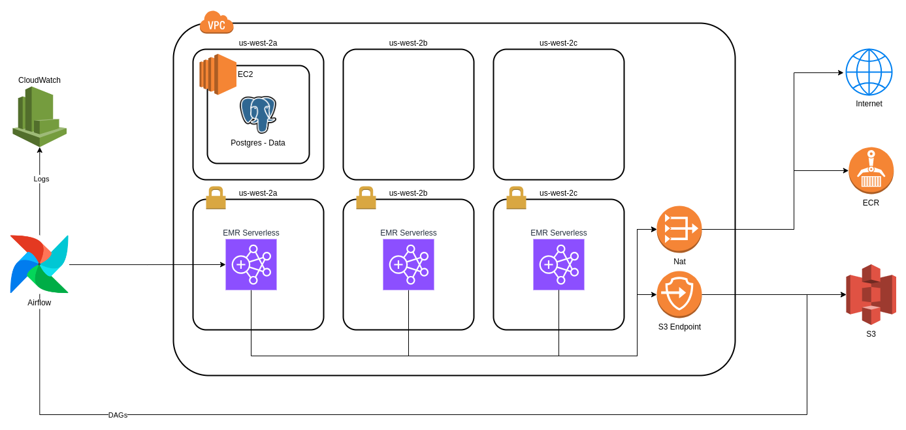

# AWS Managed Workload for Apache Airflow (MWAA)

This repository intends to provision all underline infrastructure in order use Apache Airflow as data pipeline orchestrator and spin up [EMR Serverless](https://aws.amazon.com/emr/serverless/) applications to execute [Spark Jobs](https://spark.apache.org/). As a bonus Airflow is configured to use SSM as secret backend.




In order to exemplifies how to use Airflow the following [DAGs](https://airflow.apache.org/docs/apache-airflow/stable/core-concepts/dags.html) were developed.

- [`sleep.py`](./airflow/dags/sleep.py) - Hello World Dag.
- [`secrets.py`](./airflow/dags/secrets.py) - Shows how to retrieve secrets from SSM secret backend
- [`s3.py`](./airflow/dags/s3.py) - Shows how to add a file on S3 and also list them
- [`emr-serverless-jdbc.py`](./airflow/dags/emr-serverless-jdbc.py) - Creates EMR Application to load data from Postgres
- [`emr-serverless-s3.py`](./airflow/dags/emr-serverless-s3.py) - Reads data from S3, transforms and writes back to S3

The Spark scripts and EMR strategies developed are heavily inspired by this [EMR project](https://github.com/tmissao/EMR-Serverless)

## Requisites
---
- [Create an AWS Account](https://aws.amazon.com/)
- [Install AWS CLI](https://docs.aws.amazon.com/cli/latest/userguide/getting-started-install.html)
- [Configure AWS CLI](https://docs.aws.amazon.com/cli/latest/userguide/cli-authentication-user.html)
- [Install TF_ENV](https://github.com/tfutils/tfenv)
- [Configure Terraform AWS Authentication](https://registry.terraform.io/providers/hashicorp/aws/latest/docs#environment-variables)

## Running

In order to execute the application, run the following commands.

```bash
cd terraform
tfenv install
tfenv use
terraform init
terraform apply
```

After that, access the AWS Airflow Environment and enjoy!

## Running Airflow Locally

If you would like to run airflow locally follow the steps described [here](./airflow/ReadMe.md)

## Results
---


